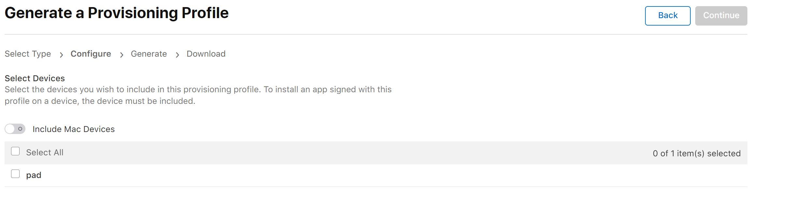

由于实验室的项目需要将flutter开发的应用做一个ios的版本，虽然flutter本身是跨平台的，但是需要编译成Ios的应用还是long way to go,

而且由于我使用的电脑是win，而开发ios应用必须要用到mac的环境，每次借电脑也不是那么方便，则在网上看到了一种可以使用github action来编译flutter ios应用的文章（github action牛逼，免费还提供mac环境）。

原文章的链接如下：https://medium.com/@pratheeshrussell/building-a-flutter-ios-app-with-codemagic-and-github-actions-9cd61321119b

作者还提供了另外一个编译ios应用的办法， 使用`codemagic`，这是一个移动应用CI网站，可以提供一些移动应用的在线编译环境，另外一种就是使用github action，两种方式我都进行了实践，都可以成功将flutter应用打包成ipa文件。

## 前言

要编译成ipa文件的flutter项目原来就在mac真机上成功编译过，也就是说已经解决了一些小问题，另外，此过程还是需要一个付费的开发者账号才能够完成，另外该流程假设您有一定的开发ios的基础，知道开发ios需要的各种中间步骤，比如申请各种苹果的证书等。

关于苹果的各种证书可以参考这篇文章 https://ask.dcloud.net.cn/article/152

### 准备证书

最后需要的有两个证书文件，一个后缀为`.p12`另外一个是`.mobileprovision`，

#### 生成p12文件

使用参考的文章中作者编写的[工具](https://pratheeshrussell.github.io/IOS-Code-Sign-Helper/)，来生成一个证书，下载该工具，然后点击新建项目


随便输入一个项目名，然后选择创建的项目，然后email处可以换成自己的苹果开发者账号对应的邮箱（不知道是否需要这么做），点击Generate Sign Requests按钮，可以选择将生成的证书放到桌面，名字如下图所示：


然后需要登录apple的开发者账号，https://developer.apple.com/membercenter

然后选择Certificates, Identifiers & Profiles


然后点击如图所示的加号


选择Apple Development 然后continue，然后会有一步让你上传一个文件，这时就把我们之前得到的证书文件上传


最后完成后点击Download，下载到桌面，没有意外的话应该是这个样子的一个文件


然后将我们之前使用的软件关闭，再打开，如果不关闭再重新打开的话 其他的tab无法检测到我们新建的项目，重新打开后，打开第二个tab，并选中我们之前创建的项目，**注意**：这里必须要创建一个密码，否则后面会有问题，可以创建一个简单的密码。


然后点击Locate选择我们刚刚的`development.cer`，然后点击generate p12，生成完成后，点击copy p12将p12文件拷贝到桌面，最后得到的文件如下：


至此，得到了一个p12文件

#### 生成mobileprovision文件

这一步首先需要申请一个App ID （App的唯一标识），详情可以参考[这篇文章](https://ask.dcloud.net.cn/article/152)，

然后回到开发者账号的Certificates, Identifiers & Profiles处，点击如下图所示的地方，生成一个Profiles


然后选中ios app development


然后选择我们刚刚创建的App ID


然后选择我们刚刚在生成`.p12`文件时生成的对应的`development.cer`，**一定要对应！**


然后device这里可以全选



最后一步，給这个profile起一个名字


最后点击下载即可


最后就能得到一个下图的文件


### 准备github action 编译

#### 准备环境

首先需要将项目上传到github上面，然后在repository的Settings中找到Secrets，增加对应的Secrets，这里增加的变量可以在github action中通过`{{ secrets.name }}`引用到，从而防止将密码明文的写在github action文件中。


CERT_PASSWORD是我们之前设置的密码


MOBILEPROVISION_BASE64是我们的`.mobileprovision`文件的base64编码，可以使用这个[网站](https://www.base64encode.org/)来将其编码成base64格式，此举是为了解决Secrets不能上传文件的问题，找到https://www.base64encode.org/网站的Encode files to Base64 format部分，上传文件，然后点击ENCODE，然后点击CLICK OR TAP HERE 复制其编码，并添加到repository的Secrets中，


P12_BASE64的过程可以参照MOBILEPROVISION_BASE64的过程，只不过需要base64编码的文件是`.p12`文件。

#### 准备action文件

在项目的.github/workflows文件夹下新建一个build.yml文件，其中的内容如下所示，这里直接使用的是[文章](https://medium.com/@pratheeshrussell/building-a-flutter-ios-app-with-codemagic-and-github-actions-9cd61321119b)的action文件的内容，做了一点点更改，更改了代码的分支以及使用的action插件的版本

```yaml
# Set the name of your workflow
name: IOSBuilder

# Controls when the action will run.
# [workflow_dispatch] --> allows to run the workflow manually
# you may use the following to build on each push
# on:
# push:
# branches: [ master ]
on: [workflow_dispatch]

# A workflow run is made up of one or more jobs that can run sequentially or in parallel
jobs:
  # In this workflow we use a single job called "build"
  build:
    # The type of runner ie, the OS that the job will run on. apart from mac windows and ubuntu are also available
    runs-on: macos-latest

    # Steps represent a sequence of tasks that will be executed as part of the job
    steps:
      # Checks-out your repository under $GITHUB_WORKSPACE, so our job can access it
     - uses: actions/checkout@v2
       with: 
          ref: ios

     - name: Create Folder for certificates and profiles
       run: |
         mkdir -p ~/Library/MobileDevice/Provisioning\ Profiles
         mkdir -p ~/Library/MobileDevice/Certificates/
       
       # decode and save the p12 and provisioning files stored as secrets
     - name: Get Certificate
       id: certFileDecode
       uses: timheuer/base64-to-file@v1.0.3
       with:
        fileName: 'certificate.p12'
        encodedString: ${{ secrets.P12_BASE64 }}
     - name: Copy Certificate
       run: mv ${{ steps.certFileDecode.outputs.filePath }} ~/Library/MobileDevice/Certificates/certificate.p12
       
     - name: Get Profile
       id: profFileDecode
       uses: timheuer/base64-to-file@v1.0.3
       with:
        fileName: 'decoded.mobileprovision'
        encodedString: ${{ secrets.MOBILEPROVISION_BASE64 }}
     - name: Copy Profiles
       run: mv ${{ steps.profFileDecode.outputs.filePath }} ~/Library/MobileDevice/Provisioning\ Profiles/decoded.mobileprovision

#install the necessary dependencies
     - name: Install python and codemagic tools
       uses: actions/setup-python@v2
       with:
         python-version: 3.7
     - name: Install python dependencies
       run:  python -m pip install codemagic-cli-tools
     - name: Initialize Keychain with certificate
       run: |
         keychain initialize
         keychain add-certificates --certificate ~/Library/MobileDevice/Certificates/certificate.p12 --certificate-password ${{ secrets.cert_password }}
    
#install flutter
     - name: Flutter get
       uses: subosito/flutter-action@v1.4.0
       with:
         flutter-version: '1.12.13+hotfix.9'
     - run: flutter pub get

#build and sign the ipa
     - name: Building IPA
       run: |
         xcode-project use-profiles
         flutter build ios --release --no-codesign
         xcode-project build-ipa --workspace ios/Runner.xcworkspace --scheme Runner --config Release
#collect the files            
     - name: collect ipa artifacts
       uses: actions/upload-artifact@v2
       with:
        name: adhoc-ipa
        # Path to the release files
        path: build/ios/ipa/*.ipa
```

将commit推到github上，在项目的action tab中，就可以看到对应的action，


点击run workflow即可，全部完成后既可找到对应的ipa文件


可以在下图的页面中找到对应的ipa文件，并可以点击下载。


至此，全部的打包工作就已经完成，可以使用github action提供的mac环境来编译flutter的ios版本。