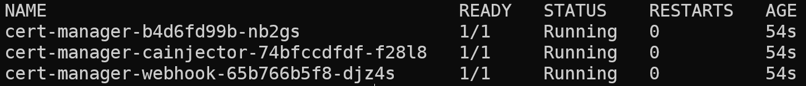
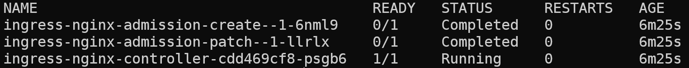
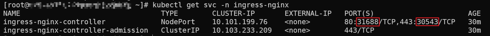
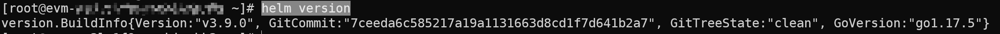
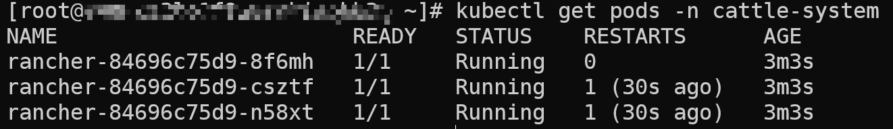
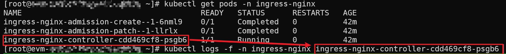
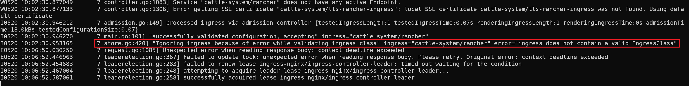

# 安装rancher

在安装rancher之前需要先安装cert-manager，以及ingress-nginx

## 安装cert-manager

使用以下命令安装
```bash
kubectl apply -f https://github.com/cert-manager/cert-manager/releases/download/v1.8.0/cert-manager.yaml
```

然后查看一下几个对应的pod是否正常启动了
```bash
kubectl get pods -n cert-manager
```

达到下面的状态表明已经安装成功


## 安装ingress-nginx

这里希望在外部访问集群内的rancher，因此需要ingress，使用以下命令来安装ingress-nginx
```bash
kubectl apply -f https://raw.githubusercontent.com/ggqshr/k8s-ingress-nginx/main/ingress-nginx-v1.1.1.yaml
```

达到下面的状态就说明ingress-nginx安装成功


且能在svc下面看到对应的NodePort服务

后续我们需要通过这两个port来访问对应的服务，在这里端口是`30543`

## 安装helm

可以使用以下命令来直接安装
```bash
curl https://raw.githubusercontent.com/helm/helm/main/scripts/get-helm-3 | bash
```

如果上面的脚本因为网络问题一直下载不下来，可以采取手动安装的方式
```bash
wget https://get.helm.sh/helm-v3.9.0-linux-amd64.tar.gz
tar -zxvf helm-v3.9.0-linux-amd64.tar.gz
mv linux-amd64/ /usr/local/include/helm
ln -s /usr/local/include/helm/helm /usr/local/bin/helm
```

然后输入以下命令
```bash
helm version
```

能够看到以下信息就说明安装成功了


## 安装rancher

添加对应的repo然后创建rancher对应的namespace
```bash
helm repo add rancher-latest https://releases.rancher.com/server-charts/latest
kubectl create namespace cattle-system
```

参考rancher官方的文档进行安装，使用以下命令来安装
```bash
helm install rancher rancher-latest/rancher \
  --namespace cattle-system \
  --set hostname=rancher.my.org
```

其中的`rancher.my.org`是可以自定义的，后面通过ingress访问时需要修改本地的hosts映射为对应的地址，这里以`rancher.my.org`为例

然后使用kubectl来查看是否安装成功
```bash
kubectl get pods -n cattle-system
```

达到以下状态说明安装成功


## 设置访问

上述的版本在安装时，默认的ingress资源会有一些问题，缺少一些相应的字段
```
store.go:420] "Ignoring ingress because of error while validating ingress class" ingress="cattle-system/rancher" error="ingress does not contain a valid IngressClass"
```

可以通过`kubectl logs`查看


能够看到下面的报错


## 登陆rancher


重置rancher密码
kubectl -n cattle-system exec $(kubectl -n cattle-system get pods -l app=rancher | grep '1/1' | head -1 | awk '{ print $1 }') -- reset-password

如果insgress一直404，需要在rancher的ingress资源的metadata中加上
annotations:
    kubernetes.io/ingress.class: "nginx"

安装cert-manager
kubectl apply -f https://github.com/cert-manager/cert-manager/releases/download/v1.8.0/cert-manager.yaml
https://github.com/cert-manager/cert-manager/releases/