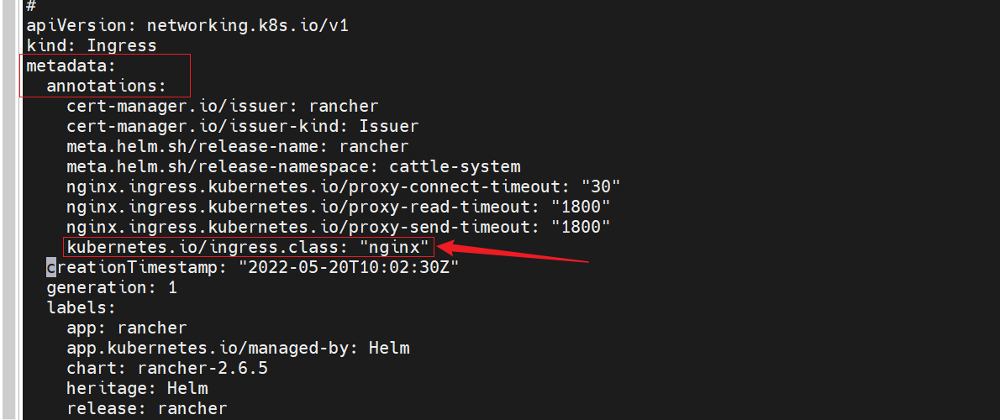
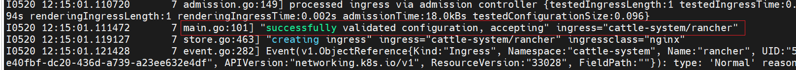
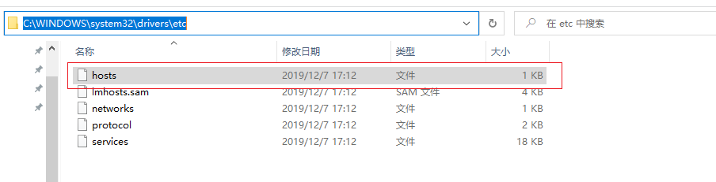
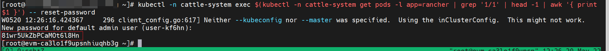

# 安装rancher

在安装rancher之前需要先安装cert-manager，以及ingress-nginx

<!-- more -->
## 安装cert-manager

使用以下命令安装
```bash
kubectl apply -f https://github.com/cert-manager/cert-manager/releases/download/v1.8.0/cert-manager.yaml
```

然后等待一下，查看一下几个对应的pod是否正常启动了
```bash
kubectl get pods -n cert-manager
```

达到下面的状态表明已经安装成功
[](https://imgtu.com/i/OOBYVI)

## 安装ingress-nginx

这里希望在外部访问集群内的rancher，因此需要ingress，使用以下命令来安装ingress-nginx
```bash
kubectl apply -f https://raw.githubusercontent.com/ggqshr/k8s-ingress-nginx/main/ingress-nginx-v1.1.1.yaml
```

达到下面的状态就说明ingress-nginx安装成功
[](https://imgtu.com/i/OOBtat)

且能在svc下面看到对应的NodePort服务
[](https://imgtu.com/i/OOBNIP)
后续我们需要通过这两个port来访问对应的服务，在这里端口是`30543`，记住这个端口，后面需要配置对应的安全组。

## 安装helm

可以使用以下命令来直接安装
```bash
curl https://raw.githubusercontent.com/helm/helm/main/scripts/get-helm-3 | bash
```

如果上面的脚本因为网络问题一直下载不下来，可以采取手动安装的方式
```bash
wget https://get.helm.sh/helm-v3.9.0-linux-amd64.tar.gz
tar -zxvf helm-v3.9.0-linux-amd64.tar.gz
mv linux-amd64/ /usr/local/include/helm
ln -s /usr/local/include/helm/helm /usr/local/bin/helm
```

然后输入以下命令
```bash
helm version
```

能够看到以下信息就说明安装成功了
[](https://imgtu.com/i/OOBaPf)

## 安装rancher

添加对应的repo然后创建rancher对应的namespace
```bash
helm repo add rancher-latest https://releases.rancher.com/server-charts/latest
kubectl create namespace cattle-system
```

参考rancher官方的文档进行安装，使用以下命令来安装
```bash
helm install rancher rancher-latest/rancher \
  --namespace cattle-system \
  --set hostname=rancher.my.org
```

其中的`rancher.my.org`是可以自定义的，后面通过ingress访问时需要修改本地的hosts映射为对应的地址，这里以`rancher.my.org`为例。（记住这个域名，后面需要修改本地的Hosts文件）

然后等待一下，使用kubectl来查看是否安装成功
```bash
kubectl get pods -n cattle-system
```

达到以下状态说明安装成功
[](https://imgtu.com/i/OOBdG8)

## 设置访问

上述的版本在安装时，rancher默认的ingress资源会有一些问题，缺少一些相应的字段
```
store.go:420] "Ignoring ingress because of error while validating ingress class" ingress="cattle-system/rancher" error="ingress does not contain a valid IngressClass"
```

可以通过`kubectl logs`查看
[](https://imgtu.com/i/OOBwRS)

能够看到下面的报错
[](https://imgtu.com/i/OOBDMQ)

这时需要修改一下rancher对应的ingress资源，加上缺失的部分，需要在metadata的annotations的字段加上`kubernetes.io/ingress.class: "nginx"`

首先使用kubectl来编辑对应的资源,rancher对应的ingress资源默认在`cattle-system`的命名空间下，名字就叫做`rancher`，使用kubectl edit 默认是用vim打开
```bash
kubectl edit ingress -n cattle-system rancher
```

在对应的字段中新增箭头所指的部分，修改完成后应该是下图中的样子，且需要注意的是，**对于缩进最好使用空格，不要使用tab，因为vim默认的tab长度不对，且可能有问题**

然后保存退出即可

如果修改正确的话，在ingress-nginx-controller的日志中可以看到如下的内容


这时就表明修改成功了
## 登陆rancher

### 配置虚机的安全组

经过上述的步骤，rancher已经搭建好了，且ingress也配置好了，可以尝试访问rancher，首先需要配置一下虚机的安全组，需要将ingress的service对应的NodePort对应的端口的入方向放通，在本文中，这个端口就是`30543`

### 修改本地的hosts映射

放通后，还需要修改本地的hosts文件，win10下`hosts`文件在下列位置:`C:\WINDOWS\system32\drivers\etc`


在文件中新增一行自定义域名映射，需要将之前安装rancher时配置的域名映射到虚机的公网ip上，在本文中，安装时配置的域名为`rancher.my.org`,假设虚机的公网ip为`1.1.1.1`，则需要在hosts文件中新增一行
```
1.1.1.1 rancher.my.org
```

保存并退出文件，然后在浏览器中可以使用自定义的域名来访问rancher，在本文中，这个地址是（要以https开头才可）
```
https://rancher.my.org:30543
```

如果顺利的话，就可以看到rancher的页面了


然后使用下列命令才重置一下rancher的密码，即可登陆
```bash
kubectl -n cattle-system exec $(kubectl -n cattle-system get pods -l app=rancher | grep '1/1' | head -1 | awk '{ print $1 }') -- reset-password
```


同时在第二个页面填写rancher的地址时，**如果后续需要纳管其他集群，需要填写一个其他集群都能够访问到的地址**，这里没有这种需求，因此直接默认即可。

如果采用本文的方式安装的rancher，是会自动纳管所在的集群的，所以登陆进去后就可以发现当前的集群已经出现在rancher中了。
