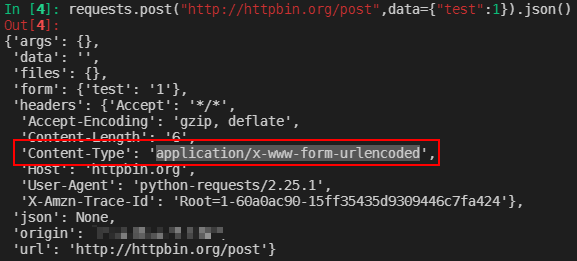
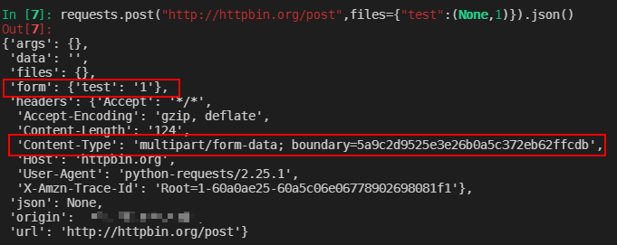
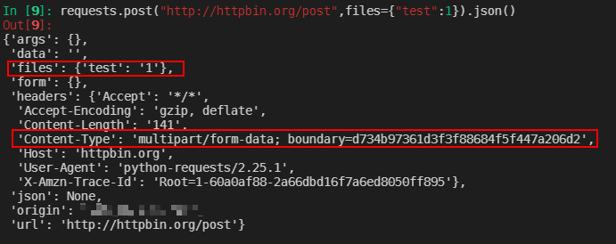

当使用requests库来发送post请求时，不同的参数写法会使得request的header中content-type有不同的值。

## Content-type为application/x-www-form-urlencoded

这应该是用的最多的一种情况，如果在发送post请求时，需要Content-type为application/x-www-form-urlencoded，则使用一下代码即可

```python
requests.post("http://httpbin.org/post",data={"test":1})
```

这样即可发送Content-type为application/x-www-form-urlencoded的请求，结果如下图：



## Content-type为multipart/form-data

这种内容的Content-type一般用在发送文件等数据上，如果只想要发送字符串，但是想要Content-type为multipart/form-data格式的话，需要采用如下的写法，并将数据传递到requests的post方法files字段当中，如下：

```python
requests.post("http://httpbin.org/post",files={"test":(None,1)})
```

这样的结果如下图：可以看到form字段为我们对应传入的数据，



如果不采用`{test:(None,1)}`的写法， 直接将`{test:1}`传入到files字段中的话，结果如下图，对应的数据跑到了files字段当中，这意味着把数据当作文件去传输了，在某些情况下，就会导致服务端收不到数据且爬虫的情况下，请求不到想要的数据。



