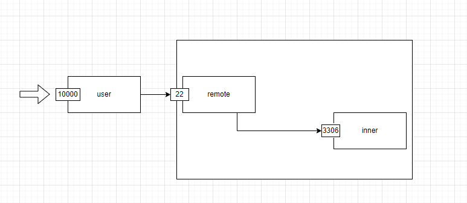
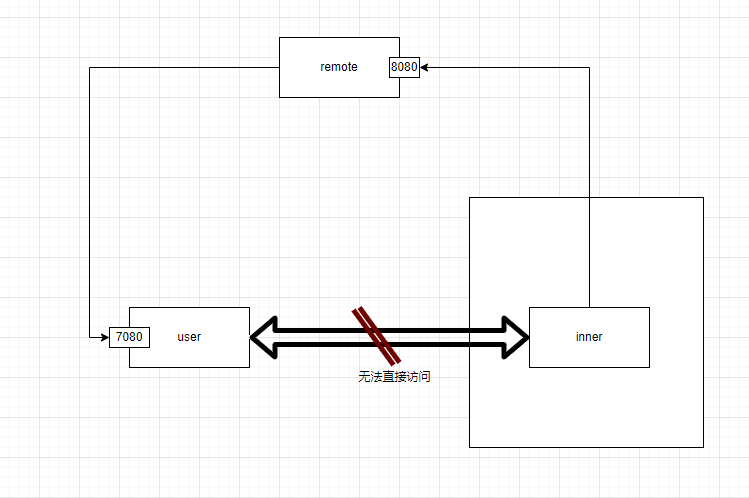
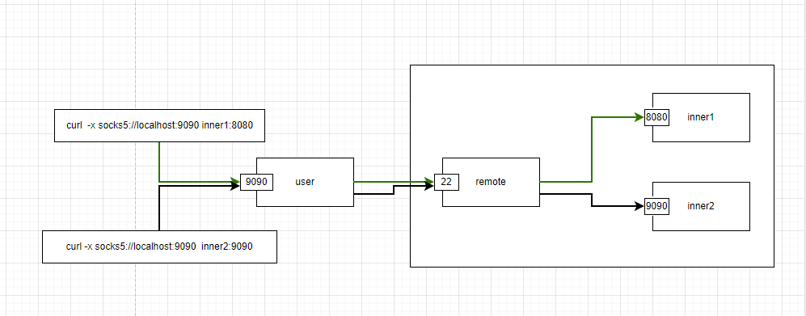

# 前言

ssh隧道代理是一种非常有用的工具， 通过ssh隧道代理，即可利用已有的ssh连接访问到远程服务器或者内网内的一些服务，对于开发中调试和测试应用非常方便，只需要ssh客户端即可，无需其他任何的额外工具。

<!-- more -->

ssh隧道代理有以下几种方式

1. 本地端口转发
2. 远程端口转发
3. 动态端口转发

## 本地端口转发

本地端口转发的目的是在本地访问远程的服务，假设我们在user机器上，而remote是一个具有公网端口的服务器，inner是一个内网服务器，inner在3306端口上提供了一个mysql的服务，而通过下面的命令即可让我们在user机器上的10000端口访问到inner的3306端口的服务，

```bash
ssh -L 10000:inner:3306 user@remote
```

上述的隧道代理通过remote中转，将发往user本地10000端口的请求通过ssh隧道代理经过remote中转转发到了inner的3306端口上。




这样我们在user即可直接访问到在内网内的inner3306服务。

## 远程端口转发

远程端口转发提供了一种能力，能够让我们在本地接收到访问远端的请求，假如我希望将remote的8080端口的所有数据通过隧道转发到本地的7080端口上，使用以下命令

```bash
ssh -R 8080:127.0.0.1:7080 user@remote
```

通过上述的命令，我们即可将访问remote8080端口的数据通过隧道全部连接到本地的7080端口上来，比较常用的场景是在开发和前端联合调试时，user没有公网ip，其他人无法直接访问到，但是大家都可以访问到公网的remote，通过这种方式，可以直接让前端访问到位于user的服务。



## 动态端口转发

上述的两种方式在使用时都需要指定单个端口，假如我们在user上需要访问内网内的多个机器上的服务，那么这时可以使用动态端口转发的方式，

将ssh隧道当作一个socks5代理，在发送访问内网的请求时指定ssh隧道对应的代理地址即可，在user上执行以下命令：

```bash
ssh -D 9090 user@remote
```

然后在user想要访问内网的机器时，只需要指定socks5代理接口，比如想要访问内网的inner的8080端口，使用curl命令

```bash
curl -x socks5://127.0.0.1:9090 inner:8080
```

这时是将ssh隧道当作一个代理，这个代理可以转发任何流量使其通过remote到达remote可以访问的机器上。



## 补充

ssh客户端的其他选项

> -f 在后台运行
>
> -N 不要执行远程命令，只充当隧道代理


