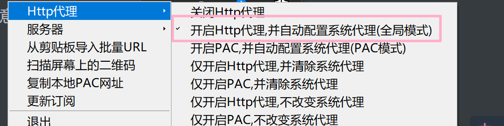
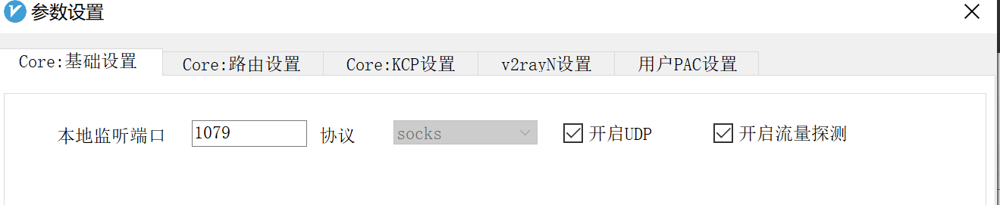

# 前言

今天偶然看到v2ray的一些资料，再加上之前一直使用ss+kcp，想测试一下v2ray是否能够有更快的速度，就简单的搭建了一个v2ray的代理

# 开始

## 服务端

这里使用的是docker安装的v2ray，使用docker安装的话需要提前准备好配置文件，然后直接使用镜像运行即可
<!-- more -->
```json
{
  "inbounds": [
    {
      "port": 16823, // 服务器监听端口
      "protocol": "vmess",    // 主传入协议
      "settings": {
        "clients": [
          {
            "id": "",  // 用户 ID，客户端与服务器必须相同
            "alterId": 64
          }
        ]
      },
     "streamSettings": {
        "network": "mkcp", //此处的 mkcp 也可写成 kcp，两种写法是起同样的效果
        "kcpSettings": {
          "uplinkCapacity": 5,
          "downlinkCapacity": 100,
          "congestion": true,
          "header": {
            "type": "none"
          }
        }
      }
    }
  ],
  "outbounds": [
    {
      "protocol": "freedom",  // 主传出协议
      "settings": {}
    }
  ]
}

```

这里使用最简单的方式，设置一个inbound和一个outbound，其中inbound中使用了kcp进行加速，这里设置的是镜像内的16823端口，则使用docker镜像映射端口时需要将外部的端口映射到16823端口上

准备好配置文件放置到`/root/v2ray/config.json`目录下，然后使用docker来安装v2ray

```bash
docker pull v2ray/official
docker run -d --name v2ray -v /root/v2ray:/etc/v2ray -p 7777:16823 -p 7777:16823/udp v2ray/official  v2ray -config=/etc/v2ray/config.json
```

注意映射端口时，也需要映射udp端口，应为kcp是使用udp进行传输，至此，就完成了v2ray的服务端搭建了。

## 客户端

win10客户端使用的是https://github.com/2dust/v2rayN/

使用起来非常简单，只需下载，然后按照配置项填写即可，有一点需要注意的是，v2rayN客户端无法手动设置本地http代理的端口，按照以下的设置开起本地的http代理后，



默认的端口时socks端口的下一个，比如socks的端口是1079，那么http的代理端口就是1080，socks的端口在下图中的地方



设置成1079那么本地http代理的端口就是1080，这样原来一些软件的设置就可以不用改变。

## 安卓端

安卓端可以使用https://github.com/2dust/v2rayNG

其他的软件可以参考这个页面https://www.v2ray.com/awesome/tools.html